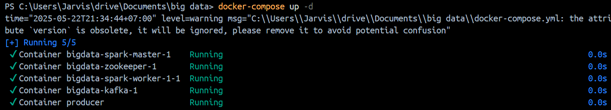
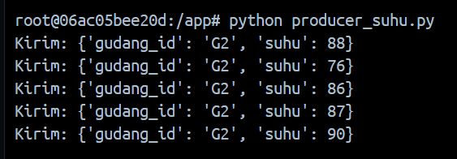
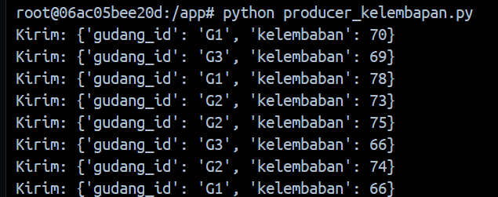
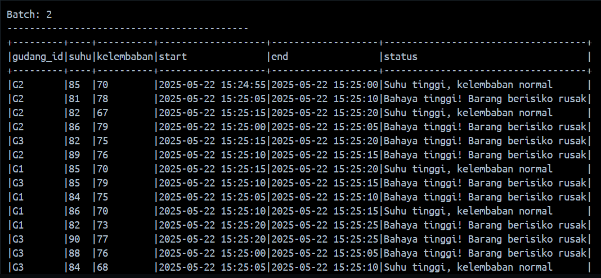

Nama : Farida Qurrotu A'yuna
NRP  : 5027231015

### Tujuan Pembelajaran :
- Memahami cara kerja Apache Kafka dalam pengolahan data real-time.
- Membuat Kafka Producer dan Consumer untuk simulasi data sensor.
- Mengimplementasikan stream filtering dengan PySpark.
- Melakukan join multi-stream dan analisis gabungan dari berbagai sensor.
- Mencetak hasil analitik berbasis kondisi kritis gudang ke dalam output console.

### Soal 
1. Membuat topik kafka (sensor-suhu-gudang dan sensor-kelembaban-gudang)
2. Membuat 2 produser (data sensor)
3. Membuat olah data dengan PySpark
4. Menggabungkan stream dari kedua sensor

### Struktur folder projeknya :


### Langkah Pengerjaan

1. Kafka, Zookeeper, dan Spark set up


2. Buat topik broker
- Masuk ke container Kafka
```
docker exec -it kafka bash
```
- Membuat broker suhu dan kelembaban
```
kafka-topics.sh --create --topic sensor-suhu-gudang --bootstrap-server localhost:9092  
kafka-topics.sh --create --topic sensor-kelembaban-gudang --bootstrap-server localhost:9092
```

3. Mensimulasikan produser kelembaban dan suhu dengan jumlah gudang 3 (G1,G2,G3)
```
docker exec -it producer bash
python producer_suhu.py
python producer_kelembapan.py
```
hasil producer suhu :


hasil produser kelembaban :


4. Konsumsi data dari kedua topik dan digabungkan
- masuk ke container spark untuk customernya
```
docker exec -it bigdata-spark-master-1 bash
```
- Menjalankan kode consumer.py
```
/opt/bitnami/spark/bin/spark-submit \
  --jars /opt/bitnami/spark/jars_kafka/spark-sql-kafka-0-10_2.12-3.5.0.jar,\
/opt/bitnami/spark/jars_kafka/kafka-clients-3.5.0.jar,\
/opt/bitnami/spark/jars_kafka/commons-pool2-2.11.1.jar \
  --conf spark.executor.extraClassPath=/opt/bitnami/spark/jars_kafka/* \
  --conf spark.driver.extraClassPath=/opt/bitnami/spark/jars_kafka/* \
  /opt/bitnami/spark/consumer/consumer.py
```


